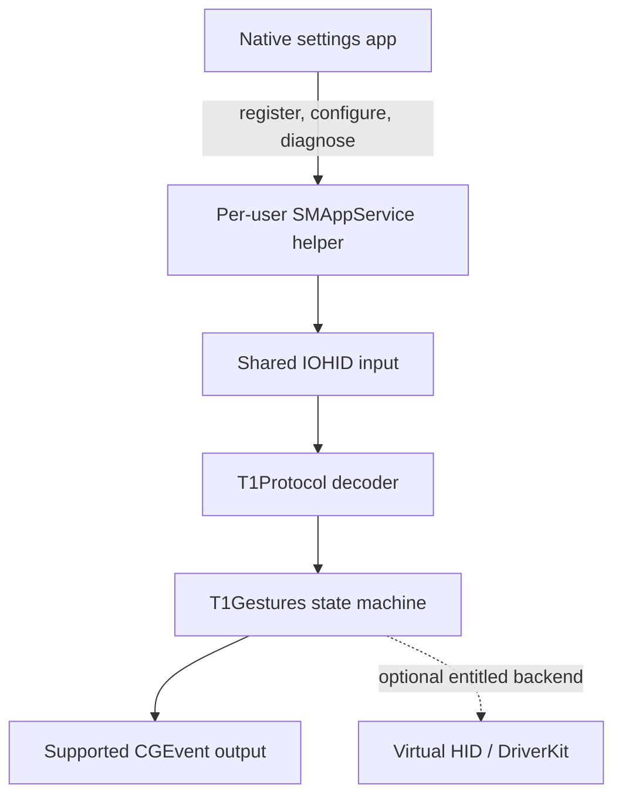

# Architecture

## Goals

The application makes an unmodified T1 Plus behave as completely and efficiently as supported
macOS APIs permit. It preserves factory firmware and normal Windows behavior.

## Process model

The settings app owns onboarding, permissions, configuration, diagnostics, updates, and uninstall.
The helper is bundled under `Contents/Library/LoginItems` and registered with `SMAppService` only
when support is enabled. Closing the settings window does not stop enabled input support. Disabling
support unregisters and terminates the helper, leaving no resident process.

The helper runs as the signed-in user. The baseline architecture has no root daemon, kernel
extension, private framework, or system-process injection.

## Core boundary

`T1Protocol` decodes fixed-size HID frames into value types. `T1Gestures` consumes those values and
emits semantic actions without importing AppKit, SwiftUI, IOKit, or CoreGraphics. macOS adapters live
in the helper. This boundary keeps captures and replay tests independent of the UI and output
backend.

The hot path accepts `UnsafeRawBufferPointer`, stores four contacts inline, and performs no heap
allocation per frame. Performance acceptance is measured with release builds and saved captures;
language choice remains evidence-based.

## Backend evolution

The supported baseline uses shared `IOHIDManager` input and `CGEvent` output. A virtual-HID backend
may be added behind the semantic-action boundary only if Apple grants the necessary entitlement and
hardware validation demonstrates a material behavior improvement. It must not be a prerequisite for
safe baseline operation.
