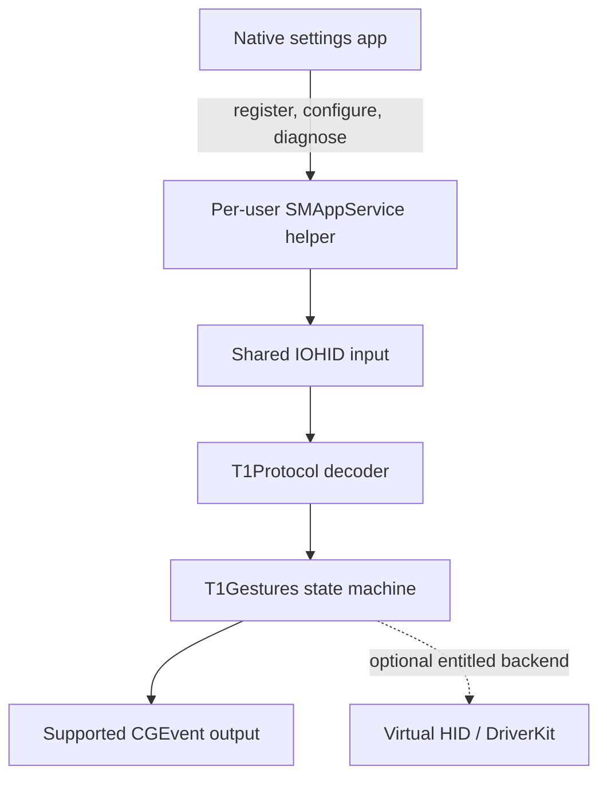

# Architecture

## Goals

The application makes an unmodified T1 Plus behave as completely and efficiently as supported
macOS APIs permit. It preserves factory firmware and normal Windows behavior.

## Process model

The settings app owns onboarding, permissions, configuration, diagnostics, updates, and uninstall.
The helper is bundled under `Contents/Library/LoginItems` and registered with `SMAppService` only
when support is enabled. Closing the settings window does not stop enabled input support. Disabling
support unregisters and terminates the helper, leaving no resident process.

Installation and Bluetooth pairing are independent. If the device is already connected, the helper
matches it when enabled. If the app is enabled first, the helper remains event-driven until the
device connects. The direct-distribution DMG instructs users to copy the app into Applications before
launching it so the login-item path remains available after the disk image is ejected.

The supported CoreGraphics backend requires two macOS privacy grants: Input Monitoring for shared
HID report access and the event-posting privilege displayed by macOS under Accessibility. The app
requests each grant only after an explicit user action and explains its use first. `SMAppService`
may separately require approval for the background item. Automation access to System Events, Screen
Recording, Full Disk Access, Bluetooth privacy, administrator access, and root authorization are not
part of the product permission model.

The main app and helper both carry the same specific Input Monitoring usage description. Production
builds use a stable signing identity, and `SMAppService` establishes the main app as the helper's
responsible code so macOS can present and retain consent under the product identity. Development
builds launched through Terminal, SSH, or a debugger are not valid permission-onboarding evidence.

The helper runs as the signed-in user. The baseline architecture has no root daemon, kernel
extension, private framework, or system-process injection.

The helper matches `04e8:7021` and the Digitizers / Touch Pad application usage, opens the device
in shared mode, and registers one persistent input-report buffer on the main run loop. Valid frames
flow directly into the gesture engine without a per-frame action collection. CoreGraphics output
owns pointer/button state and scroll momentum. New physical interactions cancel momentum and
resynchronize with the system cursor so another mouse can be used normally between touchpad
interactions.

Disconnect, stop, sleep, power-off, and inactive-session paths cancel recognition without turning
an interrupted contact into a gesture. They end active scroll phases and release every synthetic
button before the helper exits or waits for reconnection. Malformed reports are discarded without
raw-input logging or unbounded log volume. While the user session is inactive, reports cannot emit
output; if a contact was held, input remains suppressed after resume until every contact lifts.

## Core boundary

`T1Protocol` decodes fixed-size HID frames into value types. `T1Gestures` consumes those values and
emits semantic actions without importing AppKit, SwiftUI, IOKit, or CoreGraphics. macOS adapters live
in the helper. This boundary keeps captures and replay tests independent of the UI and output
backend.

The hot path accepts `UnsafeRawBufferPointer`, stores four contacts inline, and creates no per-frame
collection. Gesture actions flow through a generic sink without UI or macOS-framework coupling.
[ADR 0001](decisions/0001-use-swift-for-the-gesture-core.md) records the Swift-versus-C evidence
and the decision to use Swift. Integrated helper performance remains a release gate.

## Backend evolution

The supported baseline uses shared `IOHIDManager` input and `CGEvent` output. A virtual-HID backend
may be added behind the semantic-action boundary only if Apple grants the necessary entitlement and
hardware validation demonstrates a material behavior improvement. It must not be a prerequisite for
safe baseline operation.
